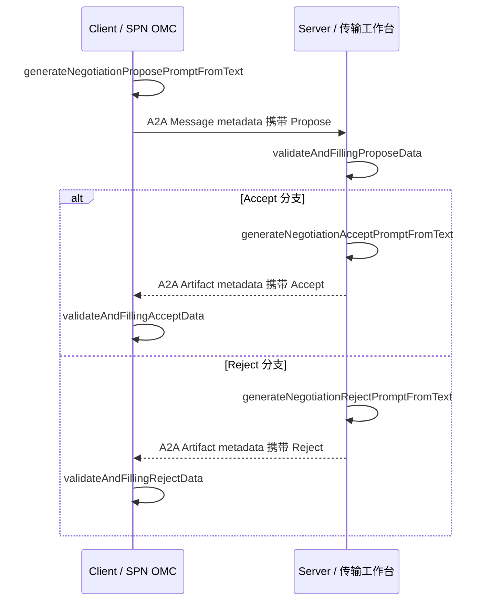

# 传输专线投诉信息协商 Sample 开发说明

## 1. 文档用途

本文用于指导后续 Code Agent 在 `a2a-t-sample` 中实现“传输专线业务投诉诊断”信息协商示例。实现应完整验证以下 6 个 Negotiation-T API，并提供可离线运行的 Mock 模式和可切换到 Qwen3-32B 的真实模型模式。

本文已按仓库提交 `52e7d29` 的公开 API 完成适配。后续开始验证前仍应同步 `main`，再次确认 API 签名和现有 Sample 结构；如接口发生变化，以最新公开 API 为准，并同步更新本文和 Sample。

## 2. 范围和边界

### 2.1 本次范围

信息协商从发起协商开始，到对端校验和提取协商信息，再到接受或拒绝，最后由发起方校验和提取协商结果。

需要实现两条可独立运行的分支：

- Accept：Propose → 校验/提参 → Accept → 校验/提参。
- Reject：Propose → 校验/提参 → Reject → 校验/提参。

一次运行只会进入 Accept 或 Reject 分支，覆盖 4 个 API；两条分支均运行成功后，才算完成 6 个 API 的验证。

### 2.2 不在本次范围内

- 不生成或校验 Task-T Prompt。
- 不实现投诉诊断业务逻辑、资源查询或根因分析。
- 不实现多轮协商状态机；第一版固定为第 1 轮，并在同一轮结束。
- 不修改 SDK 内置 Negotiation-T 模板。
- 不修改 `prompt_resources/scenarios/*/scenarios.json` 和 Task-T 的 `slot.json`。

现有资源中已经包含 `private-line-complaint` 的 Task-T 场景和槽位定义，但本 Sample 调用的 6 个 Negotiation-T API 不会走 Task-T 的场景识别、槽位提取链路。Sample 自身可以增加一个 `scenario.json` 保存演示输入，它与 SDK 的 `scenarios.json`、`slot.json` 用途不同。

## 3. 业务角色和链路

建议的 Sample 角色映射如下：

- Client：SPN OMC 侧，发起信息协商，请求补齐诊断所需信息。
- Server：传输工作台侧，校验请求并选择接受或拒绝。

角色映射仅服务于 Sample 的 HTTP 请求方向。Negotiation-T 的 Client 和 Server 门面都提供相同的 6 个接口，业务接入时可以按实际 Agent 角色调整调用方。



服务端应使用 Propose 校验结果中的 `id`、`round` 和 `maxRounds` 重建 `NegotiationContext`，确保回复和请求属于同一协商会话、同一轮次。服务端不能自行生成新的协商 ID。

## 4. 待验证 API

| 阶段 | 调用方 | API | Template URI | 结果 |
| --- | --- | --- | --- | --- |
| 生成请求 | Client | `generateNegotiationProposePromptFromText` | `Negotiation-T/information-negotiation/propose/v1` | `MetadataContent` |
| 校验请求 | Server | `validateAndFillingProposeData` | 同上 | `FilledParamData` |
| 生成接受 | Server | `generateNegotiationAcceptPromptFromText` | `Negotiation-T/information-negotiation/accept-reject/v1` | `MetadataContent` |
| 校验接受 | Client | `validateAndFillingAcceptData` | 同上 | `FilledParamData` |
| 生成拒绝 | Server | `generateNegotiationRejectPromptFromText` | `Negotiation-T/information-negotiation/accept-reject/v1` | `MetadataContent` |
| 校验拒绝 | Client | `validateAndFillingRejectData` | 同上 | `FilledParamData` |

关键类型：

```java
net.openan.a2at.sdk.client.A2ATClient
net.openan.a2at.sdk.server.A2ATServer
net.openan.a2at.sdk.negotiation.content.NegotiationContext
net.openan.a2at.sdk.core.model.MetadataContent
net.openan.a2at.sdk.core.model.FilledParamData
net.openan.a2at.sdk.core.model.TemplateUri
net.openan.a2at.sdk.core.model.StandardTemplates
```

注意 `FilledParamData` 当前位于 `a2a-t-core`，包名为 `net.openan.a2at.sdk.core.model`。

6 个接口的最后一个参数均为 `TemplateUri`。Sample 使用
`StandardTemplates.INFORMATION_NEGOTIATION_PROPOSE` 和
`StandardTemplates.INFORMATION_NEGOTIATION_ACCEPT_REJECT`，避免手写 URI；线上 metadata 仍承载
`TemplateUri.uri()` 返回的字符串。

## 5. 场景输入

建议将场景文本集中放入 Sample 资源 `sample/private-line-complaint-negotiation/scenario.json`，避免散落在 Java 常量中。第一版固定使用中文 `zh-CN`。

建议内容：

```json
{
  "scenario": "传输专线业务投诉诊断的信息协商",
  "propose_text": "当前专线业务投诉诊断缺少接入端口名称和投诉分类，请发起信息协商，请求对端补充这两项信息。接入端口名称需要提供物理端口或逻辑端口名称，投诉分类应为专线中断或专线质差。",
  "accept_text": "接受本次信息协商。接入端口名称为 P781-珠江新城-PTN7900-23-TPA1EG24-17(cvlan=100)，投诉分类为专线质差。",
  "reject_text": "拒绝本次信息协商。当前账号没有资源系统查询权限，无法取得接入端口名称和投诉分类。"
}
```

Client 创建上下文：

```java
NegotiationContext context = new NegotiationContext(UUID.randomUUID().toString(), 1, 3);
```

第一版不调用 `nextRound()`。Accept 和 Reject 都沿用 Propose 中的 `round=1`。

## 6. 参数 Schema：场景业务 Schema（调整后的方案 B）

`validateAndFilling...` 接口的 `schema` 描述调用方希望提取的业务参数，由具体 OSS 场景自行定义。本 Sample 因此直接定义“传输专线业务投诉诊断”的字段。协商模板自身的 `items`、`relationship`、`conclusion` 由 SDK 内部负责识别，不放入调用方 Schema。

### 6.1 Propose Schema

```json
{
  "type": "object",
  "additionalProperties": false,
  "properties": {
    "access_port_name": {
      "type": "string",
      "description": "请求的接入端口信息及可接受的物理或逻辑端口格式"
    },
    "complaint_category": {
      "type": "string",
      "description": "请求的投诉分类及允许的专线投诉类型"
    }
  },
  "required": ["access_port_name", "complaint_category"]
}
```

Propose 阶段提取的是待补充字段及其约束，因此值可以是“物理端口或逻辑端口名称”“专线中断或专线质差”这类要求描述。

### 6.2 Accept Schema

```json
{
  "type": "object",
  "additionalProperties": false,
  "properties": {
    "access_port_name": {
      "type": "string",
      "description": "用于专线诊断的物理或逻辑接入端口名称"
    },
    "complaint_category": {
      "type": "string",
      "description": "专线投诉分类",
      "enum": ["专线中断", "专线质差"]
    }
  },
  "required": ["access_port_name", "complaint_category"]
}
```

### 6.3 Reject Schema

Reject 消息无法提供接入端口和投诉分类，因此单独提取拒绝原因：

```json
{
  "type": "object",
  "additionalProperties": false,
  "properties": {
    "rejection_reason": {
      "type": "string",
      "description": "无法补充专线投诉信息的原因"
    }
  },
  "required": ["rejection_reason"]
}
```

Sample 内部 Schema 工厂通过 `LinkedHashMap` 构建并返回不可变 Map，Propose、Accept、Reject 各保留一个共享常量。不要复制 SDK 的私有方法，也不要通过反射调用 `NegotiationJsonSchemaBuilder` 的内部 Schema。

`id`、`round`、`maxRounds` 不放入调用方 Schema。SDK 先通过确定性规则读取这 3 个上下文字段，再与 LLM 按调用方 Schema 提取的参数合并。预期结果为：

- Propose：`id`、`round`、`maxRounds`、`access_port_name`、`complaint_category`。
- Accept：`id`、`round`、`maxRounds`、`access_port_name`、`complaint_category`。
- Reject：`id`、`round`、`maxRounds`、`rejection_reason`。

不使用 `null` Schema。空 Map 虽然可用于只验证上下文字段，但无法充分验证本任务要求的“校验和提参”。

## 7. A2A 消息承载约定

生成接口返回的 `MetadataContent` 是线上的唯一数据源。发送方必须使用 `buildMetadataContent()` 构建消息或 Artifact metadata，不能手工拼装 Negotiation-T Prompt。

当前生成结果包含两个 metadata 键：

- `https://projects.tmforum.org/a2aproject/telecommunication/extensions/Negotiation-T/v1`：`promptText`。
- `templateUri`：`MetadataContent.templateUri()` 返回的 URI 字符串。

请求头 `A2A-Extensions` 使用 `MetadataContent.extensionUri()`。新消息使用不带 `/NL/` 的规范 URI；接收侧如复用通用读取逻辑，可以兼容读取历史 `/Negotiation-T/NL/v1` URI。

建议承载方式：

- Client → Server：A2A `Message.metadata` 放 Propose 的完整 metadata。
- Server → Client：A2A `Artifact.metadata` 放 Accept 或 Reject 的完整 metadata。
- `TextPart` 可以放便于人工阅读的摘要，但校验 API 的 `prompt` 参数必须取自 Negotiation-T extension metadata。
- 接收侧同时核对 `templateUri` 与当前阶段期望 URI；缺失或不一致时立即报错，不调用校验 API。SDK 接口使用 `TemplateUri`，metadata 中保存字符串，比较时调用 `TemplateUri.uri()`。

服务端处理顺序：

1. 校验 `A2A-Extensions` 包含 Negotiation-T 规范 URI。
2. 从 `Message.metadata` 取 `templateUri` 和 Propose Prompt。
3. 调用 `validateAndFillingProposeData`。
4. 从返回值重建 `NegotiationContext`。
5. 根据 `A2AT_SAMPLE_NEGOTIATION_DECISION` 选择 Accept 或 Reject，默认 Accept。
6. 调用对应 from-text 生成 API。
7. 将结束 Prompt 放入 Artifact metadata，发送一次后结束任务。

客户端处理顺序：

1. 从 `scenario.json` 读取 `propose_text`。
2. 创建上下文并调用 Propose from-text API。
3. 发送 A2A Message。
4. 等待第一个携带 Negotiation-T metadata 的 Artifact。
5. 根据 Artifact Prompt 中的结论以及本次期望分支，调用 Accept 或 Reject 校验 API。
6. 打印 `FilledParamData.data()` 并断言上下文和业务项。

## 8. 建议代码结构

不要直接改造成现有 `subscribe_incident` Sample。保留原示例，新建独立包和资源目录，并只复用稳定的通用基础设施。

```text
a2a-t-sample/
  src/main/java/net/openan/a2at/sample/private_line_complaint/negotiation/
    client/
      NegotiationClientMain.java
      NegotiationClientFlow.java
    server/
      NegotiationServerMain.java
      NegotiationServerFlow.java
      NegotiationAgentExecutor.java
    shared/
      InformationNegotiationSchemas.java
      NegotiationMetadataReader.java
      NegotiationScenario.java
      NegotiationScenarioLoader.java
      mock/
        NegotiationMockLLMClient.java
        NegotiationMockLlmInstaller.java
  src/main/resources/sample/private-line-complaint-negotiation/
    scenario.json
    client/client.env
    server/server.env
  src/test/java/net/openan/a2at/sample/private_line_complaint/negotiation/
    InformationNegotiationSchemasTest.java
    NegotiationAcceptFlowTest.java
    NegotiationRejectFlowTest.java
    NegotiationMetadataReaderTest.java
```

可以复用或抽取现有 Sample 的以下能力：

- 环境文件解析和默认路径解析。
- AgentCard 构建、注册中心降级和直连逻辑。
- a2a-java REST Client、Embedded HTTP Server 和事件读取。
- 日志格式、错误类型和通用 metadata/event 映射。

如果抽取公共代码会明显扩大改动范围，第一版允许在新包内保留少量专用适配代码。不要让 Negotiation-T 流程依赖 `subscribe_incident` 包中的业务类名、Notification-T 常量或无限 Artifact 循环。

需要调整 `a2a-t-sample/pom.xml` 的 Java argfile 生成逻辑，为新入口生成独立文件，例如：

```text
target/negotiation-server.javaargs.txt
target/negotiation-client.javaargs.txt
```

## 9. Mock LLM 设计

本机无法访问目标 Qwen 网络，因此 Mock 模式是开发和自动化测试的必备能力。

现有 `SampleMockLLMClient` 按调用次数依次返回场景识别、槽位提取和语义校验结果，不适合 Negotiation-T。新 Mock 必须根据 `jsonSchema` 和消息内容分派响应，不能依赖全局调用序号。

建议分派规则：

1. Schema 顶层属性包含 `semantic_verdict`：返回 Negotiation 语义校验响应。
2. Schema 顶层属性包含 `items` 和 `relationship`：返回信息协商 Propose 内容提取响应。
3. Schema 顶层属性包含 `conclusion` 和 `items`：根据输入文本返回 Accept 或 Reject 内容提取响应。
4. 语义校验阶段根据待校验 Prompt 中的阶段和结论，向 `params` 写入与 Propose、Accept 或 Reject 场景 Schema 一致的业务参数。生成阶段仍返回 SDK 内部要求的 `items`、`relationship`、`conclusion` 结构。
5. 无法识别的 Schema 直接抛出清晰异常，避免误返回成功数据。

典型 Mock 响应：

```json
{
  "items": [
    { "name": "接入端口名称", "value": "物理端口或逻辑端口名称" },
    { "name": "投诉分类", "value": "专线中断或专线质差" }
  ],
  "relationship": null
}
```

```json
{
  "conclusion": "Accept",
  "items": [
    { "name": "接入端口名称", "value": "P781-珠江新城-PTN7900-23-TPA1EG24-17(cvlan=100)" },
    { "name": "投诉分类", "value": "专线质差" }
  ]
}
```

```json
{
  "semantic_verdict": true,
  "negotiation_type": "information",
  "errors": [],
  "params": {
    "rejection_reason": "当前账号没有资源系统查询权限"
  }
}
```

Mock 需要覆盖生成和校验两类 LLM 调用，并分别在 Client、Server 进程中可独立工作。

## 10. Qwen3-32B 模式

目标网络手工验证时，使用仓库已提供的 `src/main/resources/sample/private-line-complaint-negotiation/qwen.env`。其配置与 `C:\cnafan\git\design\Qwen3-32B模型调用指导.md` 一致，并额外通过 `A2AT_LLM_DISABLE_SYSTEM_PROXY=true` 绕过黄区系统代理：

```properties
A2AT_LLM_PROVIDER=openai
A2AT_LLM_MODEL=qwen3-32b
A2AT_LLM_BASE_URL=http://71.77.65.40:8008/v1
A2AT_LLM_API_KEY=not-needed
A2AT_LLM_TEMPERATURE=0
A2AT_LLM_TIMEOUT_SECONDS=60
A2AT_LLM_DISABLE_SYSTEM_PROXY=true
```

第一版不要在 Sample 中加入与 Qwen 强绑定的业务分支。先使用 SDK 当前 OpenAI-compatible Client 实测。如果模型返回合法 JSON，env 修改即可。若出现思考内容污染 JSON，或服务端明确要求 `chat_template_kwargs.enable_thinking=false`，再对 LLM Client 做最小兼容调整，并单独记录验证结果。当前网络无法直连不影响 Sample 开发完成，但最终验证文档必须标注真实模型验证所在环境和结果。

## 11. 测试要求

### 11.1 单元测试

至少覆盖：

- Propose、Accept、Reject 三个场景 Schema 的字段、required 和 enum 约束。
- metadata 中规范 Negotiation-T URI 和 `templateUri` 的读取。
- metadata 缺失、错误模板 URI、错误扩展 URI 时快速失败。
- Propose 校验结果重建上下文，数值字段通过 `Number.intValue()` 转换。
- Accept 分支调用 Accept 生成和校验 API，不调用 Reject API。
- Reject 分支调用 Reject 生成和校验 API，不调用 Accept API。
- Accept/Reject 回复沿用 Propose 的 `id`、`round`、`maxRounds`。
- Mock 根据 Schema/消息内容分派，不依赖调用顺序。

### 11.2 6 API 集成测试

增加两个不依赖 HTTP 端口的测试，使用真实 `A2ATClient`、`A2ATServer` 门面和 Mock LLM：

- `acceptFlowCoversFourApis`
- `rejectFlowCoversFourApis`

两者合并覆盖 6 个唯一 API。断言不能只检查“不抛异常”，还应检查：

- `MetadataContent.templateUri()` 和 `extensionUri()`。
- Prompt 包含同一协商上下文。
- `FilledParamData.data()` 包含上下文字段和对应阶段的场景业务字段。
- Propose 提取接入端口要求和投诉分类约束。
- Accept 提取实际接入端口和枚举范围内的投诉分类；Reject 提取明确的 `rejection_reason`。

现有 `ValidateAndFillingDataPipelineTest` 中使用脚本 LLM 的测试主要验证编排和字段合并，脚本响应本身不会被真实模型约束。因此，本 Sample 的 Mock 测试不能替代目标网络的 Qwen 手工验证。

### 11.3 本地 HTTP E2E

Mock 模式完成两次运行：

1. Server 设置 `A2AT_SAMPLE_NEGOTIATION_DECISION=accept`，Client 运行成功。
2. Server 设置 `A2AT_SAMPLE_NEGOTIATION_DECISION=reject`，Client 运行成功。

每次服务端只返回一个结束 Artifact，随后任务进入 completed 状态，禁止沿用订阅示例的无限循环。

## 12. 构建和验收命令

开发完成后至少执行：

```bash
mvn -pl a2a-t-sample -am test
mvn -pl a2a-t-sample -am spotless:check
mvn -pl a2a-t-sample -am -DskipTests package
```

本地 Mock E2E 的目标启动形式：

```powershell
$env:A2AT_SAMPLE_NEGOTIATION_DECISION="accept"
java @a2a-t-sample/target/negotiation-server.javaargs.txt
```

另开终端：

```powershell
java @a2a-t-sample/target/negotiation-client.javaargs.txt
```

Reject 分支需重启 Server：

```powershell
$env:A2AT_SAMPLE_NEGOTIATION_DECISION="reject"
java @a2a-t-sample/target/negotiation-server.javaargs.txt
```

### 12.1 目标网络 Qwen 批量验证与过程日志

进入可访问 Qwen3-32B 的目标网络后，Code Agent 应自行执行以下命令，不要修改默认 Mock 的 `client.env`、`server.env`。第三个 Java 参数指定过程日志；该日志每次 SDK 调用结束即追加一行，评测中断时已完成的记录仍可用于定位。

```powershell
mvn -pl a2a-t-sample -am -DskipTests package

java @a2a-t-sample/target/negotiation-qwen-evaluation.javaargs.txt `
  a2a-t-sample/src/main/resources/sample/private-line-complaint-negotiation/qwen.env `
  a2a-t-sample/target/negotiation-qwen-report.json `
  a2a-t-sample/target/negotiation-qwen-process.jsonl
```

验收时读取 `negotiation-qwen-report.json` 和 `negotiation-qwen-process.jsonl`：

- 汇总报告包含每条用例的 `expected`、`actual`、最终 `passed` 及耗时。
- 过程日志按 `run_id`、`case_id` 关联两个阶段：`generate` 与 `validate_and_fill`。
- `generate` 失败时，优先检查日志中的 `request.text`、`context`、`template_uri` 和异常；`validate_and_fill` 失败时，核对 `request.prompt`、`request.schema` 和异常链。
- 两阶段均成功但汇总结果失败时，比较 `expected`、`actual` 和生成 Prompt，记录为模型输出差异或断言口径问题，不应笼统归因于 SDK。

过程日志不记录 API Key。完成后在验证文档中记录模型、执行时间、报告路径、通过率以及人工抽检结论。详细字段说明见 `NEGOTIATION_QWEN_EVALUATION.zh-CN.md`。

## 13. 完成标准

满足以下条件后，Sample 开发才算完成：

- 原 `subscribe_incident` Sample 和测试不受影响。
- 新 Sample 不触发任何 Task-T API。
- Accept 和 Reject 两条 Mock HTTP 链路均可重复运行。
- 6 个目标 API 均由真实 SDK 门面调用并有明确断言。
- Propose 和结束消息通过 A2A metadata 传输，未手工拼装 Prompt。
- 三套场景业务 Schema 在校验、Mock 和断言中保持一致；生成阶段继续使用 SDK 内部内容结构。
- 同一链路的协商 ID 和轮次保持一致。
- 无真实模型配置时自动或明确进入 Mock 模式；不会误请求公网模型。
- Qwen 配置只通过 env 切换；目标网络验证结果留给后续验证文档记录。
- Maven 测试、Spotless 检查和打包通过。

## 14. Code Agent 推荐执行顺序

1. 同步代码并读取仓库根目录 `AGENTS.md`。
2. 复核 6 个 API 的最新签名、Template URI 和 `MetadataContent` 结构。
3. 新增 Propose、Accept、Reject 场景业务 Schema 工厂及测试。
4. 新增场景资源、metadata 读取器及测试。
5. 新增按 Schema 分派的 Negotiation Mock LLM 及测试。
6. 先实现不含 HTTP 的 Accept/Reject 流程测试，确认 6 个 API 行为。
7. 接入真实 a2a-java Message/Artifact 传输。
8. 增加两个 Main 入口、env 模板和 Maven java argfile。
9. 分别运行 Accept、Reject 的本地 Mock E2E。
10. 更新 `a2a-t-sample/README.zh-CN.md`，写明入口、分支选择、Mock 和 Qwen 配置方法。
11. 在目标网络执行 100 用例 Qwen 批量验证，检查汇总报告和 JSONL 过程日志；本机无法访问目标网络时，将此步骤记录为待目标网络执行。
12. 运行全部验收命令，检查工作区只包含本任务相关改动。

如后续需要提交 PR，提交必须使用 `git commit -s`，并在推送前检查 PR 范围内每个提交均带有正确的 `Signed-off-by`。
